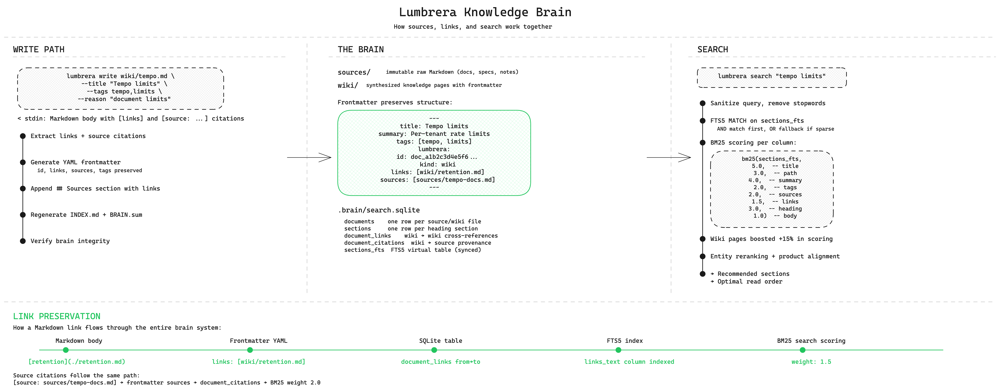

# Lumbrera

[](https://pkg.go.dev/github.com/javiermolinar/lumbrera)
[](https://goreportcard.com/report/github.com/javiermolinar/lumbrera)
[](https://github.com/javiermolinar/lumbrera/releases)

Lumbrera is a backendless, Markdown-native second brain for humans and LLM agents.

It is inspired by the Karpathy [LLM Wiki pattern](https://gist.github.com/karpathy/442a6bf555914893e9891c11519de94f): preserve raw source material, distill it into a durable human-readable Markdown wiki, and let agents help maintain that knowledge base over time.


## What problem does it solve?

Creating an LLM knowledge base is harder than it seems, especially a shareable one. LLMs are good at summarizing content but over time they start drifting. The Karpathy idea is good but it doesn't scale by itself. After a dozen documents your wiki will start to:
- drift
- lose provenance
- overwrite important context.

Lumbrera provides a small protocol and CLI boundary for maintaining source-grounded Markdown knowledge safely in local files. Git, cloud sync, backups, and sharing are external choices.
Lumbrera keeps the data as ordinary files and makes the CLI the mutation boundary. Agents may read Markdown directly, but durable changes go through `lumbrera write`, which applies path/provenance rules, regenerates metadata, and updates an internal operation log.


## How it works

<a href="lumbrera-brain.png"></a>

Lumbrera keeps brain integrity through a deterministic metadata layer. Every `lumbrera write` regenerates `BRAIN.sum` (a sha256 manifest of wiki files), `INDEX.md`, `CHANGELOG.md`, and `tags.md` from the canonical Markdown. `lumbrera verify` recomputes them and rejects drift.

To let the brain scale beyond what fits in a single context window, Lumbrera maintains a local SQLite search index with full-text search and tier-based ranking. The index is a disposable cache — delete it anytime, it rebuilds itself from the Markdown files.


## Install

```sh
go install github.com/javiermolinar/lumbrera/cmd/lumbrera@main
```

The module root is not an installable command package; use `/cmd/lumbrera`.


## How to use it

Start by initializing a new brain:

```sh
lumbrera init ./brain
```

Then drop new markdown content into the sources folder. You can convert almost anything to markdown these days.
Ask your LLM to ingest it using the skill:

```
/skill:lumbrera-ingest @sources/whatever.md
```

Start asking questions using the skill:

```
/skill:lumbrera-query how can I do X or Y?
```

The query skill starts with the local SQLite search index:

```sh
lumbrera search "how can I do X or Y?" --brain ./brain --json
```

`lumbrera search` automatically rebuilds a missing or stale local index. To inspect or force the disposable cache explicitly:

```sh
lumbrera index --status --brain ./brain
lumbrera index --rebuild --brain ./brain
```

From time to time, run the health skill to review semantic maintenance candidates:

```
/skill:lumbrera-health
```


## Source tiers

Not all sources are equal. Lumbrera infers a tier from the path and uses it to rank search results:

| Tier | Path prefix | Ranking | Use for |
|---|---|---|---|
| canonical | `sources/` `wiki/` | default (1.0) | Current product docs, operations, reference |
| design | `sources/design/` `wiki/design/` | demoted (0.45 penalty) | Proposals, ADRs, specs not yet implemented |
| reference | `sources/reference/` | demoted (0.60 penalty) | Historical docs, competition, meeting notes |

Canonical content ranks first in search. Design and reference content is still findable but structurally deprioritized. Use `--tier` to filter:

```sh
lumbrera search "querier batching" --tier design --json
```

When ingesting a design doc, preserve under `sources/design/` and create wiki pages under `wiki/design/`. The LLM sees the tier label in search results and naturally prefers canonical answers for operational questions.

