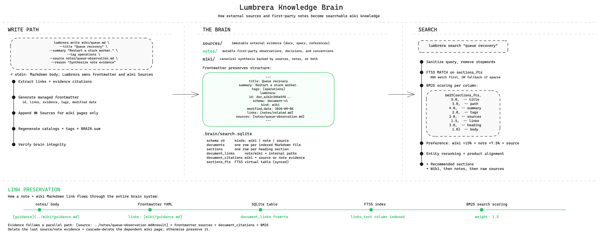

# Lumbrera

[](https://pkg.go.dev/github.com/javiermolinar/lumbrera)
[](https://goreportcard.com/report/github.com/javiermolinar/lumbrera)
[](https://github.com/javiermolinar/lumbrera/releases)

Lumbrera is a backendless, Markdown-native knowledge brain for humans and LLM agents.

It follows the Karpathy [LLM Wiki pattern](https://gist.github.com/karpathy/442a6bf555914893e9891c11519de94f), with a separate place for first-party knowledge:

- `sources/` preserves immutable external evidence.
- `notes/` stores focused, mutable observations, decisions, failed experiments, and local conventions.
- `wiki/` stores canonical synthesis backed by sources, notes, or both.
- `assets/` stores images and other supporting files.

All durable mutations cross the Lumbrera CLI boundary. The CLI validates content, maintains links and evidence, regenerates metadata, records operations, and verifies the result atomically.

<a href="lumbrera-brain.png"></a>

## Install

Install the latest macOS/Linux binary:

```sh
curl -fsSL https://raw.githubusercontent.com/javiermolinar/lumbrera/main/scripts/install.sh | sh
```

Or install from source with Go:

```sh
go install github.com/javiermolinar/lumbrera/cmd/lumbrera@latest
```

The module root is not an installable command package; use `/cmd/lumbrera`. Check the installed version with `lumbrera version`.

## Initialize a brain

```sh
lumbrera init ./brain
cd ./brain
```

A v3 brain contains:

```text
sources/          immutable preserved material
notes/            mutable first-party knowledge
wiki/             mutable canonical synthesis
assets/           supporting files
INDEX.md          generated wiki catalog
SOURCES.md        generated source catalog
NOTES.md          generated note catalog
ASSETS.md         generated asset catalog
CHANGELOG.md      append-only operation history
BRAIN.sum         generated note and wiki checksums
tags.md           generated note and wiki tag registry
.agents/skills/   bundled ingest, note, query, health, and delete workflows
.brain/           internal state and disposable search cache
```

Do not edit managed or generated paths directly. Read them freely, but use `lumbrera write` and `lumbrera delete` for changes.

## Preserve sources

Source files are immutable after creation:

```sh
lumbrera write sources/vendor/limits.md \
  --reason "Preserve vendor limits" < limits.md
```

Use the bundled ingest skill to preserve source material and synthesize wiki coverage:

```text
/skill:lumbrera-ingest @limits.md
```

## Record first-party notes

A note records one durable first-party fact without pretending that an external source exists:

```sh
lumbrera write notes/compactor-recovery.md \
  --title "Compactor recovery observation" \
  --summary "Restarting the compactor cleared the stuck tenant queue." \
  --tag operations \
  --tag compactor \
  --reason "Record recovery observation" < note.md
```

Notes have generated IDs and frontmatter, require a title, summary, and 1–5 tags, and are limited to 400 Markdown body lines. They do not accept `--source` and cannot contain a generated `## Sources` section. Update or append to a note through the same command:

```sh
lumbrera write notes/compactor-recovery.md \
  --reason "Clarify the observed sequence" < revised-note.md

lumbrera write notes/compactor-recovery.md \
  --append "Follow-up" \
  --reason "Add the recurrence result" < follow-up.md
```

The bundled note skill searches first, skips redundant or low-value capture, and writes only focused durable knowledge:

```text
/skill:lumbrera-note record what we learned from this incident
```

## Create evidence-backed wiki pages

Every wiki page must retain at least one evidence path. Evidence may come from `sources/`, `notes/`, or both:

```sh
lumbrera write wiki/compactor-recovery.md \
  --title "Recover a stuck compactor queue" \
  --summary "Procedure and evidence for recovering a stuck compactor queue." \
  --tag operations \
  --tag compactor \
  --source notes/compactor-recovery.md \
  --reason "Synthesize recovery guidance" < page.md
```

Lumbrera generates the wiki page's frontmatter and `## Sources` section. Inline citations use the same syntax for source and note evidence:

```md
The queue resumed after restart. [source: ../notes/compactor-recovery.md#result]
The supported retry limit is five. [source: ../sources/vendor/limits.md#retries]
```

Citations must resolve to a declared evidence path and an existing heading anchor. Ordinary Markdown links may connect notes and wiki pages or refer to sources and assets.

## Query and search

Use the query skill for evidence-grounded answers:

```text
/skill:lumbrera-query how do I recover a stuck compactor queue?
```

The skill starts with deterministic SQLite/FTS5 search:

```sh
lumbrera search "recover stuck compactor queue" --json
```

Default search covers wiki pages, notes, and sources, ranking equivalent matches in that order. Filter explicitly when needed:

```sh
lumbrera search "compactor queue" --kind note --json
lumbrera search "compactor queue" --source notes/compactor-recovery.md --json
```

When no wiki page matches, search recommends the best note sections before raw sources. The index at `.brain/search.sqlite` is a disposable cache; note creation, updates, and deletion make it stale just like other indexed content. Search rebuilds it automatically, or you can inspect and rebuild it:

```sh
lumbrera index --status
lumbrera index --rebuild
```

## Verify and review health

```sh
lumbrera verify
lumbrera health --json
```

Verification checks the complete v3 contract: roots and paths, managed frontmatter and IDs, note and wiki line limits, evidence, citations, ordinary links, generated catalogs, tags, checksums, and operation history. `BRAIN.sum` covers both notes and wiki pages.

Health analysis treats notes as managed knowledge for duplicate, orphan, stub, tag-anomaly, and freshness signals. Source coverage remains a wiki-only concept. Use the bundled health skill to classify candidates rather than treating candidates as conclusions:

```text
/skill:lumbrera-health
```

## Delete content safely

```sh
lumbrera delete notes/compactor-recovery.md --reason "Remove disproven observation"
lumbrera delete sources/vendor/limits.md --reason "Remove invalid source"
lumbrera delete wiki/compactor-recovery.md --reason "Remove obsolete guidance"
lumbrera delete assets/old-diagram.png --reason "Remove obsolete diagram"
```

Deleting source or note evidence removes it from dependent wiki pages. A wiki page is cascade-deleted only when no source or note evidence remains. Deletion also cleans ordinary links from surviving notes and wiki pages; asset deletion cleans links and image embeds without deleting documents. The complete plan is transactional and verified before commit.

## Source tiers

Lumbrera infers a ranking tier from path:

| Tier | Path prefix | Ranking | Use for |
|---|---|---|---|
| canonical | `sources/`, `notes/`, `wiki/` | default (1.0) | Current evidence, first-party knowledge, operations, reference |
| design | `sources/design/`, `wiki/design/` | demoted (0.45 penalty) | Proposals, ADRs, specs not yet implemented |
| reference | `sources/reference/` | demoted (0.60 penalty) | Historical and external reference material |

```sh
lumbrera search "querier batching" --tier design --json
```

Notes are canonical by default. Do not use notes as a replacement for bulk reference material or meeting transcripts.

## Migrate existing brains

The current format marker is `lumbrera-brain-v3`. The CLI recognizes v1 and v2 markers so it can direct those brains to migration; current commands require the v3 contract:

```sh
lumbrera migrate --brain .
```

Migration validates the old brain, applies v1→v2→v3 steps in order, creates note artifacts, updates unmodified bundled instructions, invalidates the search cache, regenerates derived files, and verifies the result. Customized agent files are preserved for manual reconciliation. A failed migration restores every touched path.
